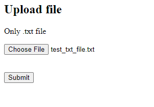

This application is being developed as a recruitment task. 
App is anable to upload a text file, read the file, shuffle the letters in the middle of each word (leaving the first and last letter in their places) and display the modified text to the user.
After uploading the file, the user is redirected to the result page, where the modified text is displayed.

# Instalation: 
1. Clone this repository.
2. Contact with me for SECRET_KEY.
3. Install requirements: <code>pip install -r requirements.txt</code>
4. Enter <code>python manage.py runserver</code> in terminal.

# How to use:
1. Visit <code>http://127.0.0.1:8000/</code>
2. Upload .txt file:

3. Wait for result:

if you try to upload file with other extension:

